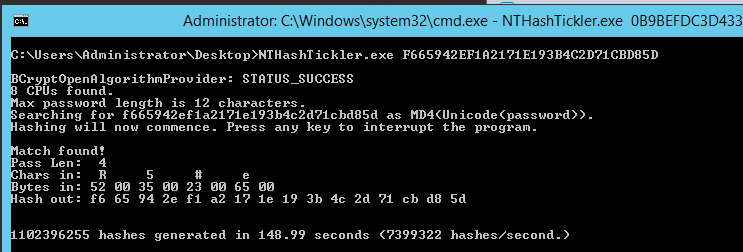

NTHashTickler_C
===============

This program uses random brute force to try to find a matching plain-text password for the NT hash that you supply. It is multi-threaded, and will use an additional thread of execution for each logical processor on your machine.

I originally wrote this program in C#, but I ported it to C and it is over seven times faster.

Windows stores NT (or NTLM) hashes as the MD4 hash of the UTF16/Unicode little endian encoded plain text.

There are plenty of other tools out there that already do this, and much better. I wrote this tool for myself as a learning
experience to exercise performance and multi threaded concepts in C#. Same goes for the C port.

